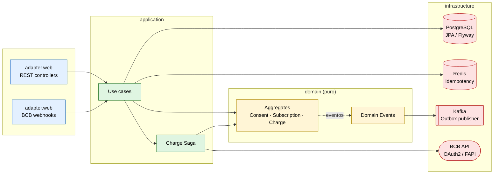
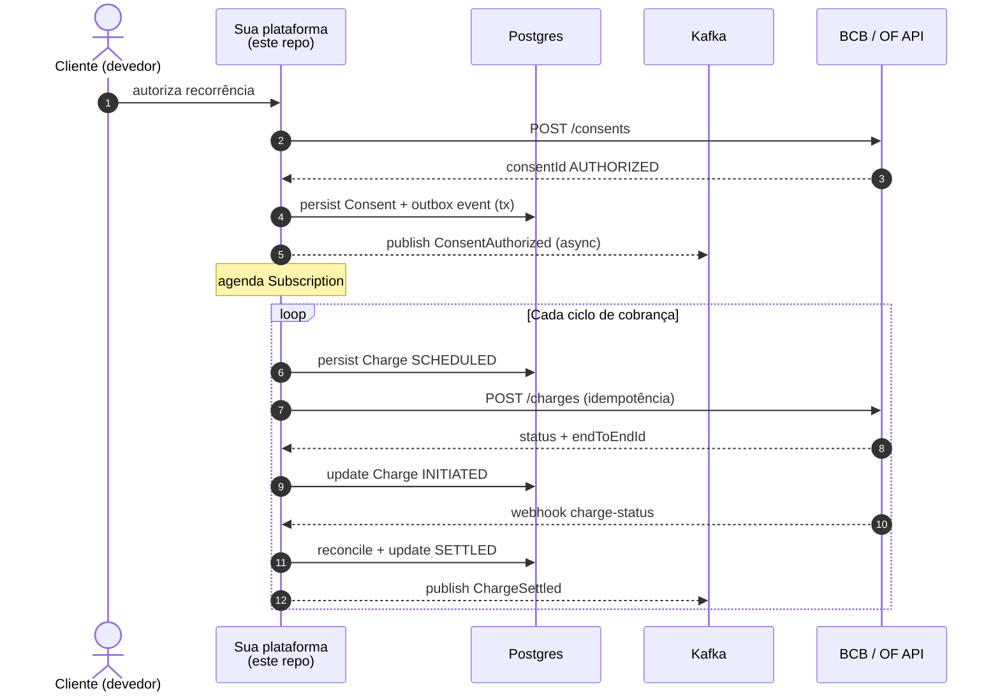
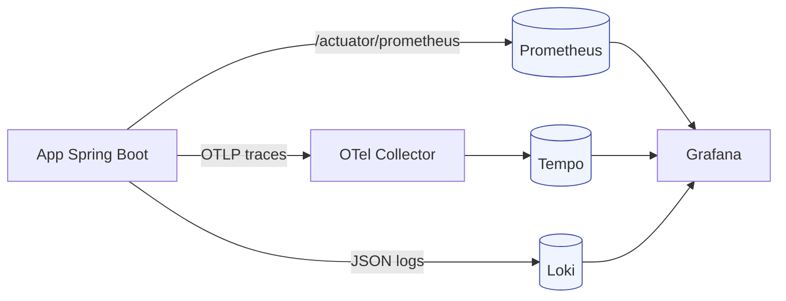

<div align="center">

# Pix Automático — Reference Implementation

**Implementação de referência *production-grade* para Pix Automático + Open Finance Brasil**

Spring Boot 3.4 · Java 21 · Hexagonal · Saga · Outbox · Idempotência forte · OpenTelemetry

[](https://github.com/Paulo-Marcos-Lucio/pix-automatico-reference/actions/workflows/ci.yml)
[](https://github.com/Paulo-Marcos-Lucio/pix-automatico-reference/actions/workflows/codeql.yml)
[](https://github.com/Paulo-Marcos-Lucio/pix-automatico-reference/actions/workflows/release.yml)
[](./LICENSE)
[](https://openjdk.org/projects/jdk/21/)
[](https://spring.io/projects/spring-boot)
[](https://www.conventionalcommits.org/)
[](./CONTRIBUTING.md)

</div>

---

> **TL;DR** &nbsp;·&nbsp; Esta é a implementação que você procuraria se sua fintech precisasse integrar com o Pix Automático **amanhã** e não pudesse errar. Hexagonal, com idempotência forte, outbox transacional, saga orquestrada, observabilidade end-to-end e testes que cobrem do agregado até o webhook. Roda 100% local com `make up`.

## Sumário

- [Por que existe](#por-que-existe)
- [Capacidades](#capacidades)
- [Arquitetura](#arquitetura)
- [Stack](#stack)
- [Quickstart](#quickstart)
- [Fluxo Pix Automático](#fluxo-pix-automático)
- [Endpoints](#endpoints)
- [Estrutura do projeto](#estrutura-do-projeto)
- [Estratégia de testes](#estratégia-de-testes)
- [Observabilidade](#observabilidade)
- [ADRs](#adrs)
- [Roadmap](#roadmap)
- [Como contribuir](#como-contribuir)
- [Segurança](#segurança)
- [Licença](#licença)
- [Autor](#autor)

---

## Por que existe

O **Pix Automático** (lançado em out/2025) e a **Fase 4 do Open Finance Brasil** tornaram obrigatória a adequação de sistemas de cobrança recorrente, assinaturas, *utilities* e fintechs a um conjunto de contratos técnicos não triviais definidos pelo Banco Central. Integrações mal-feitas resultam em **cobranças duplicadas**, **perda de conciliação**, **multas regulatórias** e **churn**.

Este repositório demonstra, em código real e executável, os padrões que uma integração **correta, auditável e resiliente** exige — sem atalhos.

## Capacidades

| Categoria | O que está implementado |
|---|---|
| **Domínio** | Agregados `Consent`, `Subscription`, `Charge` com domain events e invariantes do BCB |
| **Idempotência** | `Idempotency-Key` (UUIDv4) + Redis + unique constraint em DB — defesa em profundidade |
| **Consistência** | **Outbox Pattern**: transação local atômica + publisher Kafka assíncrono |
| **Orquestração** | **Saga orquestrada**: `autorizar → agendar → iniciar → conciliar` com compensação |
| **Resiliência** | Resilience4j: circuit breaker, retry, rate limiter, bulkhead — por endpoint |
| **Segurança** | Spring Security + OAuth2 Client Credentials simulando **mTLS / FAPI** para BCB |
| **Observabilidade** | OpenTelemetry traces + Prometheus metrics + Loki logs estruturados, **correlacionados por `traceId`** |
| **Testes** | Unitário (domínio puro), integração (Testcontainers), contrato (Pact), arquitetura (ArchUnit) |
| **Migrations** | Flyway versionado |
| **Contratos** | OpenAPI 3 autogerado (SpringDoc) |
| **Decisões** | 5 ADRs documentando cada escolha arquitetural não trivial |

## Arquitetura

Arquitetura **hexagonal** (Ports & Adapters). O domínio é puro: nem Spring, nem Jakarta, nem JPA. ArchUnit valida as fronteiras no CI.



Diagramas **C4** detalhados em [`docs/architecture/`](./docs/architecture/).

## Stack

| Camada | Tecnologia |
|---|---|
| Runtime | Java 21 (virtual threads) |
| App framework | Spring Boot 3.4 + Spring Web MVC |
| Persistência | PostgreSQL 16 + Spring Data JPA + Flyway |
| Cache / Idempotência | Redis 7 |
| Mensageria | Apache Kafka 3.8 (KRaft, sem ZooKeeper) |
| Resiliência | Resilience4j 2.2 |
| Tracing | OpenTelemetry → Tempo |
| Métricas | Micrometer → Prometheus → Grafana |
| Logs | Logback JSON estruturado → Loki |
| Segurança | Spring Security + OAuth2 client/resource server |
| API docs | SpringDoc OpenAPI 3 |
| Testes | JUnit 5 · Testcontainers · Pact · ArchUnit · JaCoCo |
| Build | Maven 3.9 (wrapper) |
| Container | Buildpacks (Spring Boot OCI image) |
| CI/CD | GitHub Actions · CodeQL · Semgrep · Trivy · Dependabot |

## Quickstart

**Pré-requisitos:** JDK 21, Docker Desktop, ~4 GB de RAM livre.

```bash
# 1. Clonar
git clone https://github.com/Paulo-Marcos-Lucio/pix-automatico-reference.git
cd pix-automatico-reference

# 2. Sobe Postgres + Redis + Kafka + stack de observabilidade
make up

# 3. Roda a app (perfil local)
make run

# 4. Verifica
curl -s http://localhost:8080/actuator/health | jq .
```

**Acessos:**

| Serviço | URL | Notas |
|---|---|---|
| API | http://localhost:8080 | |
| OpenAPI UI | http://localhost:8080/swagger-ui.html | contratos vivos |
| Actuator | http://localhost:8080/actuator | health, metrics, info |
| Grafana | http://localhost:3000 | login anônimo (admin) |
| Prometheus | http://localhost:9090 | |
| Tempo (traces) | http://localhost:3200 | acessar via Grafana |
| Kafka UI | http://localhost:8089 | |

**Targets úteis do Makefile:**

```bash
make up        # docker-compose up -d
make down      # derruba (preserva volumes)
make test      # mvn test (unit)
make it        # mvn verify (unit + integration via Testcontainers)
make image     # build OCI image via Buildpacks
make clean     # mvn clean + docker volumes prune
```

## Fluxo Pix Automático

Resumido — detalhe completo em [`docs/flows/charge-saga.md`](./docs/flows/charge-saga.md).



**Garantias do fluxo:**

- ✅ Cobrança duplicada é matemática-impossível (idempotência em 3 camadas)
- ✅ Falha entre `update DB` e `publish Kafka` é resolvida pelo Outbox (eventual consistency)
- ✅ Webhook reentrante: mesmo `endToEndId` chegando 2× não causa double-credit
- ✅ Saga compensa ao falhar entre etapas (rollback de side-effects parciais)

## Endpoints

| Método | Path | Descrição | Idempotente |
|---|---|---|---|
| `POST` | `/v1/consents` | Cria Consent de recorrência | ✅ |
| `GET` | `/v1/consents/{id}` | Consulta Consent | — |
| `POST` | `/v1/consents/{id}/revoke` | Revoga Consent | ✅ |
| `POST` | `/v1/subscriptions` | Cria Subscription vinculada a um Consent | ✅ |
| `POST` | `/v1/charges` | Agenda/inicia Charge | ✅ |
| `GET` | `/v1/charges/{id}` | Consulta Charge | — |
| `POST` | `/webhooks/bcb/charge-status` | Recebe notificação do BCB | ✅ |

> Todos os `POST` exigem header `Idempotency-Key: <UUIDv4>`. Reuso da mesma key com payload divergente retorna `422 Unprocessable Entity`.

Exemplos prontos em [`requests.http`](./requests.http) (compatível com IntelliJ HTTP Client e VS Code REST Client).

## Estrutura do projeto

```
pix-automatico-reference/
├── src/main/java/dev/pmlsp/pixauto/
│   ├── domain/                 # puro: entidades, agregados, eventos, ports
│   │   ├── model/              # Consent, Subscription, Charge, value objects
│   │   ├── port/in/            # use case interfaces
│   │   ├── port/out/           # repositories, gateways, stores
│   │   └── exception/
│   ├── application/            # casos de uso, saga, services
│   ├── infrastructure/         # adapters de saída (JPA, Kafka, Redis, BCB HTTP)
│   │   ├── persistence/
│   │   ├── messaging/
│   │   ├── cache/
│   │   └── config/
│   └── adapter/web/            # controllers, DTOs, exception handlers
├── src/main/resources/
│   ├── application.yml
│   └── db/migration/           # Flyway
├── src/test/java/.../
│   ├── domain/                 # testes unitários puros
│   ├── application/            # casos de uso com ports mockados
│   ├── architecture/           # ArchUnit
│   └── integration/            # Testcontainers (Postgres + Redis + Kafka)
├── config/                     # configs do otel-collector, prometheus, grafana, etc
├── docs/
│   ├── adr/                    # decisões arquiteturais
│   ├── architecture/           # C4 (context, container, component)
│   └── flows/                  # diagramas de fluxos críticos
├── docker-compose.yml          # stack completa de apoio
├── Makefile                    # DX: up/down/test/it/run/image
└── pom.xml
```

## Estratégia de testes

| Tipo | Onde | Ferramentas | O que valida |
|---|---|---|---|
| Unitário | `domain/`, `application/` | JUnit 5 + AssertJ | Regras de negócio do BCB, invariantes de agregados |
| Integração | `integration/` | Testcontainers (Postgres + Redis + Kafka) | Idempotência real, outbox, persistence, saga end-to-end |
| Arquitetura | `architecture/` | ArchUnit | Camadas hexagonais não vazam (domínio sem Spring etc.) |
| Contrato | `pact/` | Pact JVM | Compatibilidade do contrato consumido do BCB |
| Cobertura | — | JaCoCo | Reporta no PR via Codecov |

**Regra de ouro:** integração nunca usa mock para banco/Kafka/Redis — sempre Testcontainers. Mock em testes de I/O é dívida técnica disfarçada de teste rápido.

## Observabilidade

Tudo correlacionado por `traceId` propagado via W3C Trace Context.



Cada request HTTP, evento Kafka, query JPA e chamada externa gera um span com tags consistentes (`http.method`, `messaging.kafka.topic`, `db.statement`). Métricas expostas via Micrometer (latência p50/p95/p99, taxa de erro, circuit breaker state). Logs JSON com `traceId`, `spanId`, `idempotencyKey` e `consentId` — joinable com traces no Grafana.

## ADRs

Toda decisão arquitetural não trivial é documentada como ADR ([Architecture Decision Record](https://adr.github.io/)).

| # | Decisão |
|---|---|
| [0001](./docs/adr/0001-hexagonal-architecture.md) | Arquitetura hexagonal (Ports & Adapters) |
| [0002](./docs/adr/0002-idempotency-strategy.md) | Estratégia de idempotência em 3 camadas |
| [0003](./docs/adr/0003-outbox-pattern.md) | Outbox Pattern para consistência eventual |
| [0004](./docs/adr/0004-charge-saga.md) | Saga orquestrada vs coreografada |
| [0005](./docs/adr/0005-observability.md) | Observabilidade e correlação por `traceId` |

## Roadmap

- [ ] Suporte a **DICT** (consulta de chave Pix antes de cobrar)
- [ ] **Conciliação batch** com extrato BCB diário
- [ ] **Multi-tenant** via `tenantId` propagado por toda a stack
- [ ] **Chaos testing** com Toxiproxy nos Testcontainers
- [ ] Helm chart para deploy em Kubernetes
- [ ] Dashboards Grafana versionados como código (Jsonnet)
- [ ] Performance benchmark (p99 < 200ms para `POST /charges`)
- [ ] Migração para **Java 25** (plano em `.github/java-upgrade/`)

Veja [issues abertas](https://github.com/Paulo-Marcos-Lucio/pix-automatico-reference/issues) para o detalhe.

## Como contribuir

PRs muito bem-vindas. Leia [`CONTRIBUTING.md`](./CONTRIBUTING.md) — em resumo:

- Conventional Commits
- Testes obrigatórios para mudanças funcionais
- ADR para decisões não triviais
- ArchUnit não pode regredir

## Segurança

Para reportar vulnerabilidade, **não abra issue pública**. Use [Security Advisories](https://github.com/Paulo-Marcos-Lucio/pix-automatico-reference/security/advisories/new). Detalhes em [`SECURITY.md`](./SECURITY.md).

## Licença

[MIT](./LICENSE) © 2026 Paulo SP.

## Autor

Construído por **Paulo SP** — [@Paulo-Marcos-Lucio](https://github.com/Paulo-Marcos-Lucio) no GitHub, [LinkedIn](https://www.linkedin.com/in/paulo-marcos-a07379174/) — como referência pública para **consultoria em integrações regulatórias** (Pix Automático, Open Finance, Open Insurance).

> Sua empresa precisa de revisão de arquitetura ou implementação de integração com Pix Automático ou Open Finance? Me chama no [LinkedIn](https://www.linkedin.com/in/paulo-marcos-a07379174/) ou abre uma [issue de contato](https://github.com/Paulo-Marcos-Lucio/pix-automatico-reference/issues/new?labels=contact).

---

<div align="center">

**Se este repositório te ajudou, deixa uma ⭐ — ajuda outros engenheiros a encontrarem.**

</div>
