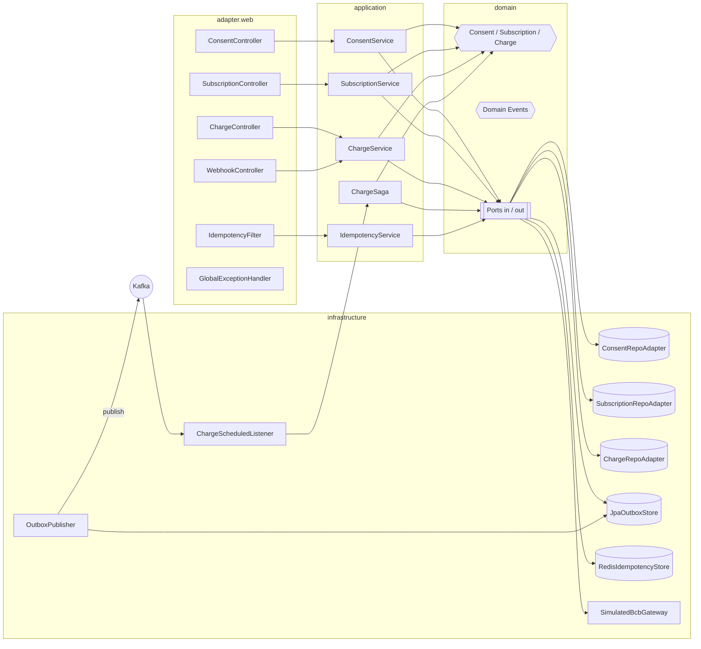

# C4 — Nivel 3: Componentes da API

## Regras ArchUnit

- `domain` nao importa `infrastructure`, `adapter`, `org.springframework.*`, `org.hibernate.*`.
- `application` nao importa `infrastructure`, `adapter`.
- `adapter` nao e acessado por ninguem (e entry point).
- Teste automatizado em `HexagonalArchitectureTest` falha o build se violado.
