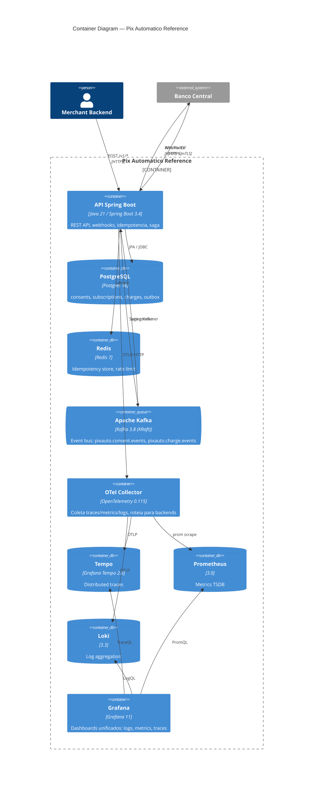

# C4 — Nivel 2: Containers

```mermaid
C4Container
title Container Diagram — Pix Automatico Reference

Person(merchant, "Merchant Backend")
System_Ext(bcb, "Banco Central")

Container_Boundary(pixauto, "Pix Automatico Reference") {
    Container(api, "API Spring Boot", "Java 21 / Spring Boot 3.4", "REST API, webhooks, idempotencia, saga")
    ContainerDb(postgres, "PostgreSQL", "Postgres 16", "consents, subscriptions, charges, outbox")
    ContainerDb(redis, "Redis", "Redis 7", "Idempotency store, rate limit")
    ContainerQueue(kafka, "Apache Kafka", "Kafka 3.8 (KRaft)", "Event bus: pixauto.consent.events, pixauto.charge.events")
    Container(otel, "OTel Collector", "OpenTelemetry 0.115", "Coleta traces/metrics/logs, roteia para backends")
    ContainerDb(tempo, "Tempo", "Grafana Tempo 2.6", "Distributed traces")
    ContainerDb(prometheus, "Prometheus", "3.0", "Metrics TSDB")
    ContainerDb(loki, "Loki", "3.3", "Log aggregation")
    Container(grafana, "Grafana", "Grafana 11", "Dashboards unificados: logs, metrics, traces")
}

Rel(merchant, api, "POST /v1/*", "HTTPS")
Rel(bcb, api, "Webhooks", "HTTPS")
Rel(api, bcb, "APIs Pix/OF", "HTTPS + mTLS")
Rel(api, postgres, "JPA / JDBC")
Rel(api, redis, "Lettuce")
Rel(api, kafka, "Spring Kafka")
Rel(kafka, api, "Saga consumer")
Rel(api, otel, "OTLP/HTTP")
Rel(otel, tempo, "OTLP")
Rel(otel, loki, "OTLP")
Rel(otel, prometheus, "prom scrape")
Rel(grafana, prometheus, "PromQL")
Rel(grafana, tempo, "TraceQL")
Rel(grafana, loki, "LogQL")
```
