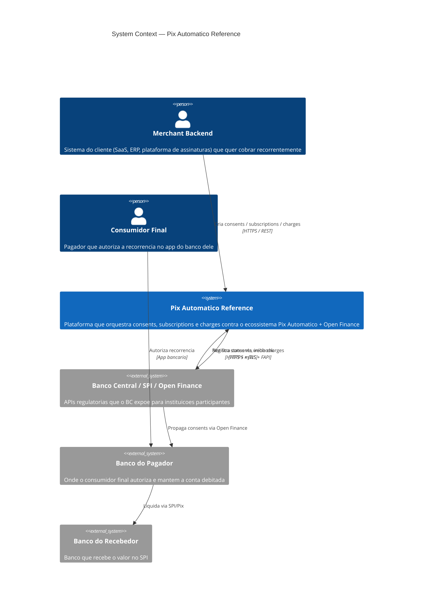

# C4 — Nivel 1: Contexto

## Fluxo macro

1. Merchant cria `Consent` na nossa plataforma.
2. Plataforma registra no BC e marca como `AWAITING_AUTHORIZATION`.
3. Consumidor final autoriza no banco dele (fora de escopo desse sistema). BC notifica a plataforma via webhook -> `AUTHORIZED`.
4. Merchant cria `Subscription` + `Charge` (um por ciclo).
5. Saga dispara `initiateCharge` no BC quando chega a data.
6. BC executa SPI e devolve webhook com `SETTLED` ou `FAILED`.
