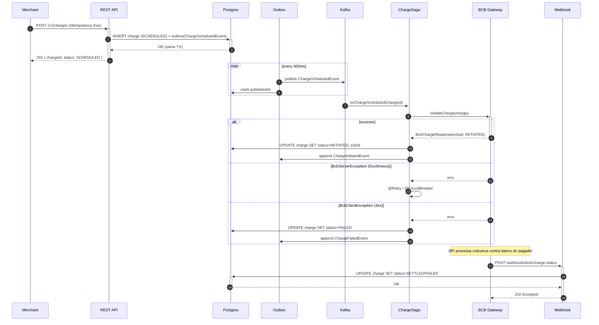

# Fluxo detalhado — Charge Saga

## Invariantes

- Uma cobranca nunca vai de `SCHEDULED -> SETTLED` direto (precisa passar por `INITIATED`).
- `INITIATED` sempre tem `endToEndId` nao-nulo.
- Webhook que chega antes do retorno sincrono do BC e tratado pela idempotencia da state machine: se ja estamos em `INITIATED`, `settle()` transiciona; se estamos em `SCHEDULED`, throw `IllegalStateException` (400/409 pro BC) e o BC reprocessa.
- Eventos no outbox sao numerados por `occurredAt` e consumidos em ordem por agregado (partition key = `aggregateId`).
